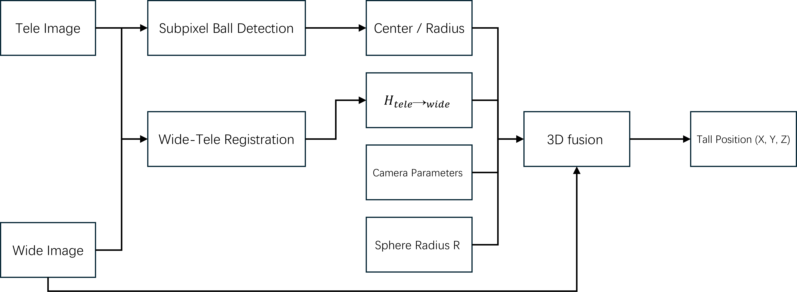
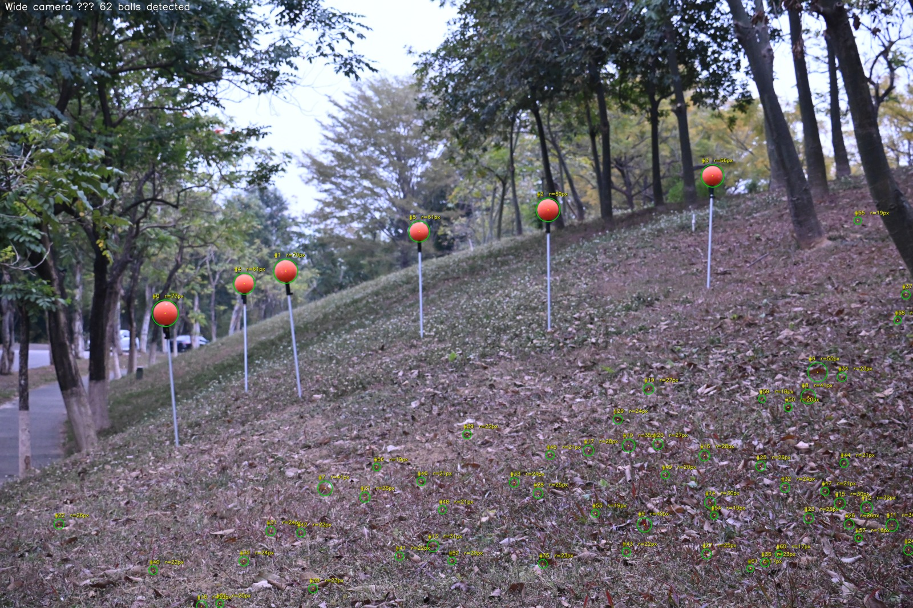
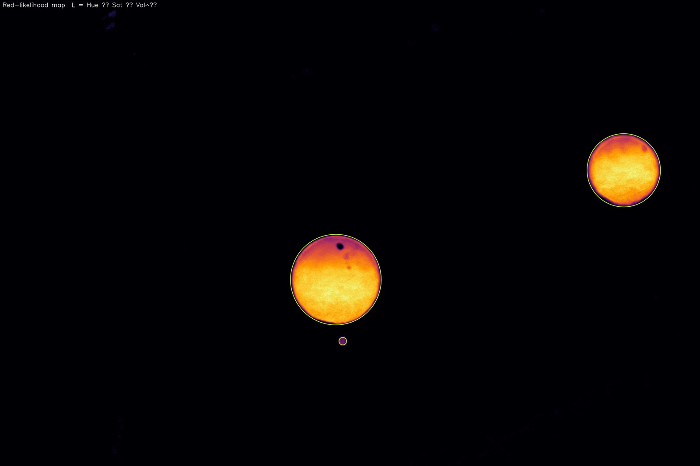
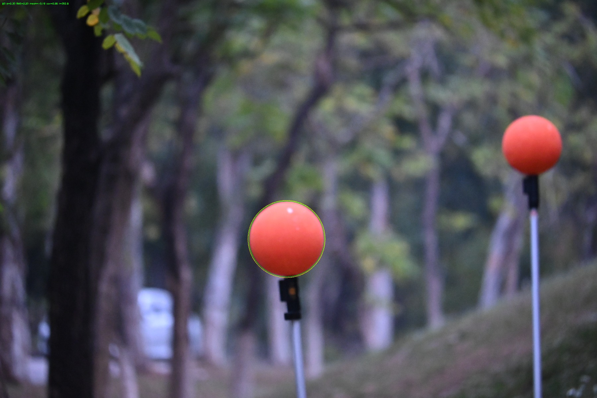
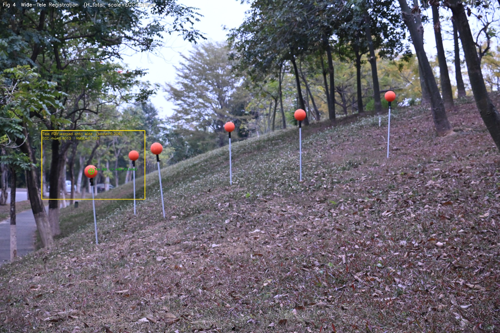
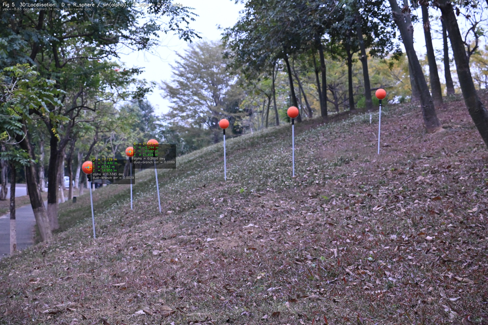

# Wide-Tele 3D Ball Localisation


A vision pipeline for **high-precision 3D localisation of survey markers on slopes**,
using a single zoom camera that captures both a wide-angle overview and a telephoto
close-up — no stereo rig, no LiDAR, no inter-camera baseline required.



---

## Application

Monitoring long-term surface displacement on slopes requires repeated, precise measurement
of fixed reference markers across a wide spatial range. Traditional instruments (total
stations, GNSS) are accurate but demand on-site access; photogrammetric methods need
multi-view rigs or dense stereo setups.

This pipeline automates marker localisation from a **single fixed camera position**,
working at ranges of 15–25 m with centimetre-level 3D accuracy.

---

## Input: wide-angle overview + telephoto close-up

The system takes two images captured at the same instant from the same camera, at
different focal lengths.

**Wide-angle image** — captures the full slope scene and all markers simultaneously:


**Telephoto image** — zooms in on selected markers for precise measurement:


This two-focal-length design mirrors how biological vision works: a wide field of view
for scene-level awareness, a narrow field for precise measurement of the target.
It avoids the mechanical complexity of a two-camera rig — but it also introduces a
hard geometric constraint described below.

---

## The core constraint — and how it is resolved

Because the camera uses a **varifocal (zoom) lens**, both images share the same optical
centre. There is no physical baseline between them.

This means **stereo triangulation is impossible**: depth from parallax requires two
viewpoints separated by a baseline; here the baseline is zero and epipolar geometry does
not apply.

The tele→wide pixel mapping is instead a pure rotation + zoom, fully described by a
3×3 homography H with no translation component.

Depth must therefore come from a different source: the **known physical size of the
marker**. A sphere of radius R that subtends angular radius α satisfies:

```
D = R / sin(α)
```

This single equation is the geometric foundation of the entire pipeline. Every
algorithmic choice that follows — subpixel boundary detection, multi-scale
registration, distortion correction — exists to make `α` as accurate as possible.

---

## Pipeline

Four stages. Wide detects; tele measures; registration links the two; depth and direction fuse into a 3D position.

---

### Stage 1 — Wide-angle target detection

The wide image scans the full scene and identifies all marker candidates using HSV
segmentation. This gives the positions and approximate sizes of every visible marker,
which then anchor the telephoto registration in Stage 2.



*All markers detected and labelled in the wide-angle image.*

---

### Stage 2 — Subpixel circle fit (tele image)

The telephoto image provides high angular resolution on each marker. Because `α` is
computed from the fitted radius, circle-fit error propagates directly into distance
error — making subpixel accuracy here a hard requirement for centimetre-level output.

**Red-likelihood map:** a smooth per-pixel redness score
`L = hue_closeness × saturation × value^γ` replaces the binary HSV mask with a
continuous boundary signal, avoiding hard-thresholding artefacts near shadows and
specular highlights.



**Subpixel boundary sampling:** radial profiles at 720 angles, 0.5 px step. Each
edge is located via gradient-peak parabola fit then refined by cross-threshold
interpolation.

**IRLS circle fit** with Huber M-estimator — specular highlights and partial
occlusions are down-weighted, not discarded:

```
e_i = ||p_i − c|| − r
w_i = min(1,  k·σ / |e_i|)     k = 1.345,   σ = 1.4826 · MAD(e)
```

The covariance matrix gives per-parameter uncertainty.



| | cx | cy | r | Coverage |
|---|---|---|---|---|
| Marker #0 | 2673.45 px | 2226.74 px | 352.80 px | 97.9% |
| Std | ±0.086 px | ±0.092 px | ±0.063 px | — |


| | cx | cy | r | Coverage |
|---|---|---|---|---|
| Marker #1 | 4961.96 px | 1350.80 px | 280.59 px | 98.3% |
| Std | ±0.185 px | ±0.191 px | ±0.133 px | — |

Sub-pixel centre accuracy **< 0.2 px std**, 98% angular coverage.

---

### Stage 3 — Wide-tele registration

To convert tele pixel coordinates into wide camera rays, the homography H\_total
mapping tele → wide pixels must be estimated. The zoom ratio is **unknown at runtime**
(it varies with zoom position) so it cannot be pre-calibrated and must be solved
per-image.

The search is **target-driven**: anchored to the detected marker centre, not the full
image — concentrating computation where accuracy matters.

**Multi-scale template matching** over 33 candidate scale values, scored as:

```
logpost = NCC  +  w_PSR · PSR  +  w_prior · log p(s)
```

PSR (Peak-to-Sidelobe Ratio) measures match-peak sharpness. A log-Gaussian prior on
scale prevents degenerate solutions. **ECC** refinement then aligns the best scale to
sub-pixel accuracy.

The three components compose into one homography:

```
H_total = T · ECC · S

H_total =
⎡ 0.20625  −0.00117  466.77 ⎤
⎢ 0.00117   0.20625  1448.85 ⎥
⎣ 0.00000   0.00000    1.00  ⎦
```

Scale = **0.206**, rotation = **0.33°** — consistent with a zoom lens.



*Tele image (warped by H\_total) alpha-blended onto wide. Green crosshair = tele
marker centre projected via H\_total.*

| ECC ρ | Photometric RMSE | Scale |
|-------|-----------------|-------|
| 0.8013 | 0.1521 | 0.206 |

---

### Stage 4 — 3D fusion

Depth from **tele angular radius** combined with direction from the **wide camera ray**:

```
α  =  median  atan2(||r_c × r_b||,  r_c · r_b)   over all ~700 boundary rays
D  =  R / sin(α)
P  =  D · undistort( H_total · p_tele )
```

Using the median of all boundary ray angles — not just the fitted radius — adds a
further layer of robustness against any outlier boundary points retained by IRLS.



| Marker | D (m) | X (m) | Y (m) | Z (m) | α (°) |
|--------|-------|-------|-------|-------|-------|
| #0 | 17.129 | −2.430 | +0.143 | 16.955 | 0.3345 |
| #1 | 21.571 | −2.244 | −0.132 | 21.454 | 0.2656 |

**Dual-branch consistency check:** the same depth D is independently fused via a
yaw/pitch rotation matrix derived from H\_total — a completely different geometric
path. Sub-centimetre agreement between the two validates the pipeline end-to-end.

| Marker | ‖P\_H − P\_R‖ |
|--------|--------------|
| #0 | **3.9 mm** |
| #1 | **6.9 mm** |

---

## Run the demo

```bash
pip install -r requirements.txt
python ball_3d_localization_demo.py
```

No dataset required — synthetic images are generated at runtime.

To reproduce the field figures above, place both input images in the same
directory as the script, then run:

```bash
python generate_demo_visuals.py
# requires in the same directory:
#   Img238.jpg   (wide-angle image)
#   Img333.jpg   (telephoto image)
```

---

## Repository structure

```
ball_3d_localization_demo.py    Core algorithm modules + synthetic smoke test
generate_demo_visuals.py        Full self-contained pipeline → demo_output/
requirements.txt                Python dependencies
LICENSE                         MIT
demo_output/                    Output figures (generated by above script)
```

---

## Dependencies

`opencv-python ≥ 4.5`  ·  `numpy ≥ 1.22`  ·  `Python ≥ 3.10`

---

## License

MIT
