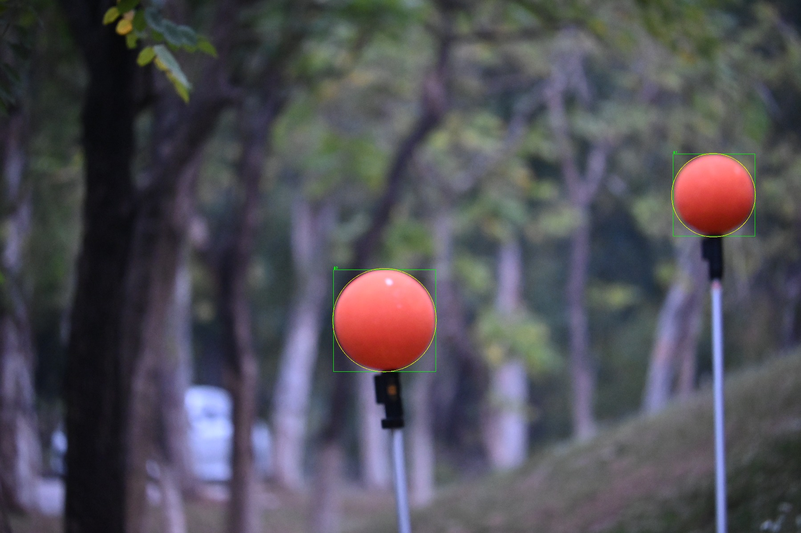

# Wide-Tele 3D Ball Localisation


End-to-end pipeline for estimating the **3D centre position of a spherical target**
using a zoom (varifocal) camera that captures both a wide-angle and a telephoto image
from the same optical centre. Implemented with `opencv-python` and `numpy` only.


---

## System constraints and why they matter

Understanding the design decisions requires being explicit about the physical setup.

**The camera uses a varifocal (zoom) lens.** Wide and tele images are captured at different
focal lengths but from the **same optical centre** — there is no physical baseline between
them. This has two critical consequences:

**1. No stereo triangulation is possible.**
Depth from parallax requires two viewpoints separated by a baseline. Here the baseline is
zero. Standard epipolar geometry does not apply.

**2. The tele-to-wide pixel mapping is a homography.**
Because there is no translation, the projective relationship between the two images is a
pure rotation + zoom — a 3×3 homography H. This is the geometric fact the registration
stage exploits.

**Depth is therefore recovered from a different source: the known physical size of the
target.** A sphere of radius R that subtends angular radius α satisfies:

```
D = R / sin(α)
```

This single equation is the load-bearing idea of the entire system. Every other component
— subpixel detection, multi-scale registration, distortion correction — exists to make α
as accurate as possible.

---

## Pipeline

Three stages, each building on the last. Real outputs from field images are shown at each
step.

---

### Stage 1 — Subpixel ball detection (tele image)

The tele image is used for depth estimation. The angular radius α is computed from the
fitted circle radius, so circle fit error maps directly to distance error. The pipeline
therefore invests heavily in sub-pixel accuracy here.

#### 1a. HSV segmentation and candidate selection

The image is converted to HSV and thresholded across both red-hue wrap regions (0° and
180°). Morphological open + close removes noise. Contours are filtered by area, circularity
(≥ 0.55), and minimum enclosing-circle radius (≥ 18 px).

| Step | Parameter |
|------|-----------|
| Hue bands | [0°, 12°] and [160°, 180°] |
| Min saturation | 70/255 |
| Morphology kernel | 7 × 7, open × 1, close × 2 |
| Min circularity | 0.55 |
| Min radius | 18 px |


*Binary mask after morphological cleaning. Each connected component is a ball candidate.*



*Two valid candidates (green box + yellow coarse circle). Their coarse centre and radius
seed the subpixel refinement below.*

#### 1b. Red-likelihood map

Rather than using the binary mask as the signal for edge detection, a smooth continuous
**redness score** is computed per pixel:

```
L(x, y) = hue_closeness(x,y)  ×  saturation(x,y)  ×  value(x,y)^γ
```

`hue_closeness` falls linearly from 1 at the red hue centre to 0 at `hue_width = 20°` away,
wrapping correctly at 0° / 180°. The `value^γ` term (`γ = 0.5`) softly down-weights dark
pixels (shadows, partial occlusions) without hard-thresholding them.

The result is a map where each ball appears as a smooth bright region with a sharp
falloff at the boundary — exactly the profile shape the radial sampler expects.


#### 1c. Radial profile sampling and sub-pixel edge detection

At **720 equally-spaced angles**, a radial scan is cast from the coarse centre outward
through a ±26 px band around the coarse radius, sampled at **0.5 px steps** via bilinear
interpolation. Each radial profile is Gaussian-smoothed (σ = 1.2 px) before analysis.

A profile is accepted only when all three conditions hold:

```
L_in  ≥ 0.06   (scanner is inside the ball)
L_out ≤ 0.05   (scanner has exited the ball)
L_in − L_out ≥ 0.03   (there is a real colour transition)
```

This rejects rays that graze the edge, pass through shadows, or hit background clutter —
ensuring only clean boundary crossings contribute to the fit.

For each accepted profile the edge position is refined in two stages:

1. **Parabola fit** on the three samples surrounding the steepest gradient — gives
   approximately 0.1 px accuracy with no additional computation.
2. **Cross-threshold interpolation**: the exact crossing of the level
   `t = L_out + α(L_in − L_out)` is found by linear interpolation between adjacent
   samples. The threshold blend factor α is chosen by sweeping
   `[0.15, 0.20, 0.25, 0.30, 0.35]` and selecting the value that minimises the
   subsequent IRLS residual.

Alpha sweep for Ball #0 — best α = **0.30**:

| α | n\_pts | coverage | RMS (px) | mean (px) | r\_fit (px) | score |
|---|--------|----------|----------|-----------|-------------|-------|
| 0.15 | 679 | 94.3% | 2.684 | −0.355 | 354.91 | 2.872 |
| 0.20 | 691 | 96.0% | 2.617 | −0.329 | 354.10 | 2.893 |
| 0.25 | 697 | 96.8% | 2.387 | −0.261 | 353.48 | 2.722 |
| **0.30** | **705** | **97.9%** | **2.203** | **−0.192** | **352.80** | **2.606** ✓ |
| 0.35 | 716 | 99.4% | 2.286 | −0.201 | 352.06 | 2.805 |

Score = `RMS + 0.5|mean| + λ|r_fit − r_area|`. Lower is better.

#### 1d. IRLS robust circle fit

The ~700 accepted boundary points are fitted to a circle using **Iteratively Re-weighted
Least Squares** with a Huber M-estimator. The algebraic residual for point i is:

```
e_i = ||p_i − c|| − r
```

At each iteration, point weights are updated as:

```
w_i = min(1,  k·σ / |e_i|)      k = 1.345  (Huber threshold)
σ   = 1.4826 · MAD(e)            (robust scale, consistent for Gaussian noise)
```

Points corrupted by specular highlights or partial occlusion get down-weighted rather than
discarded. The Gauss-Newton parameter update is:

```
[Δcx, Δcy, Δr] = (JᵀWJ + λI)⁻¹ Jᵀ W (−e)
```

After convergence, the covariance matrix `(JᵀWJ)⁻¹ σ²` is used to report per-parameter
standard deviations.

**Ball #0:**


*Red dots: accepted sub-pixel boundary points. Yellow circle: coarse HSV fit. Green circle: IRLS result.*

| Parameter | Value | Std |
|-----------|-------|-----|
| cx | 2673.448 px | ± 0.086 px |
| cy | 2226.738 px | ± 0.092 px |
| r  | 352.804 px  | ± 0.063 px |
| Angular coverage | 97.9% | — |
| Boundary points used | 705 | — |

**Ball #1:**


| Parameter | Value | Std |
|-----------|-------|-----|
| cx | 4961.955 px | ± 0.185 px |
| cy | 1350.802 px | ± 0.191 px |
| r  | 280.590 px  | ± 0.133 px |
| Angular coverage | 98.3% | — |
| Boundary points used | 712 | — |

**Sub-pixel centre accuracy < 0.2 px std, 98% angular coverage on both balls.**

---

### Stage 2 — Wide-tele image registration

The goal is to find the homography H that maps any tele pixel to the corresponding wide
pixel. Because the camera is a zoom lens (shared optical centre), H is a **similarity
transform** — scale, rotation, and translation in the image plane — with no perspective
distortion.

Registration is **target-driven**: rather than matching the full images (which would be
expensive and unreliable across very different scales), the search is anchored to the
detected ball centre. The tele patch is matched against the region of the wide image where
the ball is expected to appear. This concentrates the search near the region where accuracy
matters and avoids being misled by background clutter elsewhere in the frame.

#### 2a. Multi-scale template matching with PSR scoring

The scale factor between tele and wide is unknown at runtime — it depends on the zoom
position which changes between shots. A grid of **33 candidate scales** is searched in the
range `s_prior ± 45%` (with `s_prior = 0.24`). At each scale, the tele gradient-magnitude
image is resized and matched against the corresponding wide region using
`cv2.TM_CCOEFF_NORMED`.

The match is scored as a log-posterior:

```
logpost = NCC  +  w_PSR · PSR  +  w_prior · log p(s)
```

**PSR** (Peak-to-Sidelobe Ratio) measures the sharpness of the NCC response peak relative
to the background sidelobe level. A high PSR signals an unambiguous, well-localised match;
a low PSR suggests multiple similar regions or a scale mismatch. The log-Gaussian prior
`log p(s)` penalises scales far from `s_prior`, preventing degenerate solutions at extreme
scale ratios.

Best match: **scale = 0.2062**, NCC = 0.1933, **PSR = 10.02**.

A PSR above 8–10 is generally considered a confident match.

#### 2b. ECC sub-pixel refinement

At the best scale, `cv2.findTransformECC` refines a 2×3 Euclidean warp (rotation +
translation, no shear or scale change) to sub-pixel accuracy by maximising the Enhanced
Correlation Coefficient between the resized tele patch and the corresponding wide region.

ECC warp matrix:

```
⎡ 0.99998  −0.00567   1.772 ⎤
⎣ 0.00567   0.99998  −6.146 ⎦
```

The implied rotation is **0.325°** — consistent with a zoom lens introducing negligible
rotation between focal lengths. The (1.8, −6.1) px translation at the scaled resolution
corrects the residual alignment offset after template matching.

#### 2c. Composing H\_total

The three layers are combined into a single 3×3 homography:

```
H_total = T · ECC · S
```

where S is the scale matrix, ECC is the refined Euclidean warp, and T is the
translation from template matching. This matrix directly maps any tele pixel to a wide
pixel, valid in the neighbourhood of the target.

```
H_total =
⎡ 0.20625   −0.00117   466.77 ⎤
⎢ 0.00117    0.20625  1448.85 ⎥
⎣ 0.00000    0.00000     1.00 ⎦
```

The 0.206 diagonal confirms the zoom ratio. The off-diagonal terms encode the tiny
rotation. The right column places the tele FOV within the wide image coordinate system.

**Registration quality — alpha blend:**

The tele image (scaled and warped by H\_total) is alpha-blended onto the wide image.
A correctly registered pair shows continuous edges with no ghosting.


*The yellow box marks the tele FOV projected onto the wide image. The green crosshair
marks the tele ball centre mapped via H\_total — it lands precisely on the wide ball.*

| Metric | Value |
|--------|-------|
| Scale (tele / wide) | 0.2062 |
| ECC ρ | 0.8013 |
| Photometric RMSE | 0.1521 |

---

### Stage 3 — 3D fusion

With the subpixel circle fit from Stage 1 and H\_total from Stage 2, the 3D position is
recovered by combining a depth estimate from tele with a direction estimate from wide.

#### 3a. Depth from angular radius (tele)

Rather than using the paraxial approximation `α ≈ r_px / f`, depth is estimated from the
subpixel boundary points directly. Each boundary point is unprojected through K\_tele (with
distortion correction) to a unit ray, and the angle between the centre ray and that
boundary ray is computed as:

```
α_i = atan2( ||r_c × r_b||,  r_c · r_b )
```

The `atan2` form avoids the numerical precision loss of `acos` at small angles. The
**median** over all ~700 boundary angles is taken as the final α — robust to the outlier
points that the IRLS fit down-weighted but did not discard.

```
D = R_sphere / sin(α)
```

#### 3b. Direction from wide camera

The tele ball centre is projected into the wide image via H\_total:

```
[u_w, v_w, 1]ᵀ  ∝  H_total · [cx_t, cy_t, 1]ᵀ
```

This wide pixel is then undistorted using K\_wide and the wide distortion coefficients,
giving the unit direction ray r\_w in the wide camera frame.

#### 3c. 3D position

```
P_wide = D · r_wide
```

The wide camera is the reference frame. X is right, Y is down, Z is forward along the
wide optical axis.


| Ball | D (m) | X (m) | Y (m) | Z (m) | α (°) |
|------|-------|-------|-------|-------|-------|
| #0 | 17.129 | −2.430 | +0.143 | 16.955 | 0.3345 |
| #1 | 21.571 | −2.244 | −0.132 | 21.454 | 0.2656 |

Tele optical axis relative to wide: **yaw = −8.83°, pitch = +0.34°**

#### Dual-branch consistency check

As an internal validation, the same depth D is independently combined with the tele ray
rotated into the wide frame via a yaw/pitch rotation matrix — derived from where the tele
principal point maps in the wide image. The two routes to P\_wide use completely different
geometric paths (H\_total vs explicit rotation matrix), so agreement between them is a
strong indicator that both registration and depth estimation are correct.

| Ball | ‖P\_H − P\_R‖ |
|------|--------------|
| #0 | **3.9 mm** |
| #1 | **6.9 mm** |

Sub-centimetre agreement on both balls confirms mutual consistency of the pipeline.

---

## Run the demo

```bash
pip install opencv-python numpy
python ball_3d_localization_demo.py
```

Runs all three core modules on **synthetic images** — no dataset required.

Expected output:

```
[Module 1] Subpixel ball detection on synthetic image …
  Ground truth : cx=318.7  cy=241.3  r=58.5
  Detected     : cx=318.72 ± 0.08  cy=241.31 ± 0.07  r=58.48 ± 0.05  (n_pts=287)
  Centre error : 0.021 px

[Module 2] Wide-tele registration on synthetic pair …
  Best scale   : 0.250  (target ≈ 0.250)
  NCC          : 0.8941
  ECC ρ        : 0.9712

[Module 3] 3D fusion with known camera parameters …
  Ground truth : Z = 3.000 m
  Estimated    : X=0.0000  Y=0.0000  Z=3.0002 m
  Depth error  : 0.02 cm
```

To reproduce the field-data figures above:

```bash
python generate_demo_visuals.py   # requires Img238.jpg (wide) + Img333.jpg (tele)
```

---

## Repository structure

```
├── ball_3d_localization_demo.py     Core algorithm modules + synthetic smoke test
│   ├── compute_red_likelihood()       HSV likelihood map
│   ├── detect_ball_subpixel()         Segment → radial sample → IRLS fit
│   ├── robust_circle_fit()            IRLS + Huber weights + covariance
│   ├── register_tele_to_wide()        Multi-scale TM + PSR scoring + ECC
│   ├── estimate_distance_from_angular_radius()   D = R / sin(α)
│   ├── undistort_to_unit_ray()        Pixel → unit direction ray
│   └── fuse_3d_position()             Full dual-branch 3D fusion
│
├── generate_demo_visuals.py         Runs the full pipeline on real field images
│                                    and produces all figures in demo_output/
│
└── demo_output/                     Output figures (generated by above script)
    ├── 00_pipeline_diagram.jpg
    ├── mask_clean.jpg
    ├── tele_candidates_overlay.jpg
    ├── 03_likelihood_map.jpg
    ├── tele_target_00_overlay.jpg
    ├── tele_target_01_overlay.jpg
    ├── 04_registration_blend.jpg
    └── 05_3d_result.jpg
```

---

## Dependencies

- Python ≥ 3.10
- `opencv-python` ≥ 4.5
- `numpy` ≥ 1.22

---

## License

MIT
