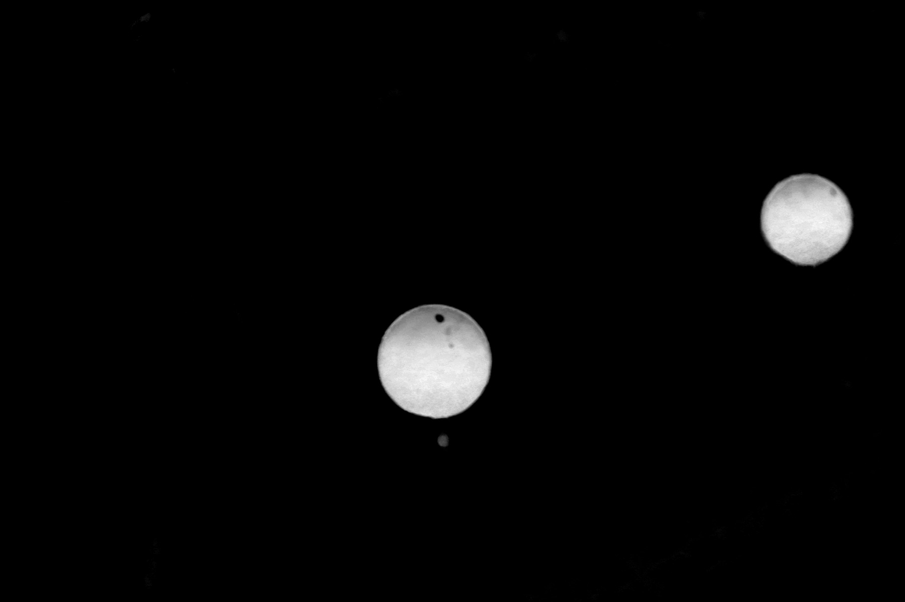

# Wide-Tele 3D Ball Localisation

End-to-end pipeline for estimating the **3D position of a spherical target** from a dual-camera
wide + tele system, using only `opencv-python` and `numpy`.

---

## Constraints and design decisions

Before describing the algorithm, it is worth being explicit about what physical constraints
this system relies on — because the entire approach is designed around them.

**The system uses a zoom (varifocal) lens**, not two physically separate cameras.
Wide and tele images are captured from the **same optical centre**, just at different focal
lengths. This has one critical consequence:

> The transformation from tele pixels to wide pixels is a **pure rotation + zoom** — there is
> no translation between the two camera frames.

In the projective sense this means the mapping between the two images is a **homography H**,
not a full rigid-body transform with baseline. There is no stereo disparity, no epipolar
geometry, no baseline to calibrate. This simplifies the geometry enormously but also means
**standard stereo triangulation is impossible** — you cannot recover depth from parallax
because there is none.

Instead, depth is recovered from a completely different source: the **known physical size of
the target**. A sphere of radius R that subtends an angular radius α in the image is at
distance:

```
D = R / sin(α)
```

This is the load-bearing equation of the entire pipeline. Everything else — subpixel detection,
image registration, distortion correction — exists to make α as accurate as possible.

---

## Pipeline

The full pipeline has three stages. They are described below in order, with real outputs
from the field images interleaved at each step.

---

### Stage 1 — Subpixel ball detection (tele image)

The tele image is used for depth estimation, so the quality of the circle fit directly
determines the quality of α and therefore D. A coarse HSV detection gives a bounding
circle; the subpixel stage then refines it.

#### 1a. HSV segmentation and candidate selection

The image is converted to HSV and thresholded for red hues in both the 0° and 180° wrap
regions. Morphological open + close cleans the mask. Contours are filtered by area,
circularity (≥ 0.55), and minimum radius (≥ 18 px).


The two valid candidates are highlighted. Their coarse parameters (yellow circle) feed
into the subpixel stage.

#### 1b. Red-likelihood map

Rather than working directly with the binary mask, a smooth **per-pixel redness score** is
computed:

```
L(x, y) = hue_closeness(x,y) × saturation(x,y) × value(x,y)^γ
```

`hue_closeness` is the normalised distance from the red hue band (0° / 180°), giving 1 at
the centre of the band and 0 at `hue_width` away. The value-gamma term down-weights dark
pixels (shadows, specular occlusions) without hard-thresholding them.



The ball edges appear as sharp transitions in L — exactly what the radial sampler needs.

#### 1c. Radial profile sampling and sub-pixel edge detection

At 720 equally-spaced angles, a radial scan is cast outward from the coarse centre through
a band of ±26 px around the coarse radius, sampled at 0.5 px steps via bilinear
interpolation. Each profile is Gaussian-smoothed (σ = 1.2 px).

A profile is accepted only if:
- Inner likelihood `L_in ≥ 0.06` (we are inside the ball)
- Outer likelihood `L_out ≤ 0.05` (we are outside the ball)
- Contrast `L_in − L_out ≥ 0.03` (there is a real edge)

For accepted profiles, the edge position is located at the steepest descent of the profile.
Two sub-pixel refinements are applied in sequence:

1. **Parabola fit** on the three samples around the gradient peak — gives ~0.1 px accuracy
   at no extra cost.
2. **Cross-threshold interpolation** in a local window: the exact crossing of the threshold
   `t = L_out + α(L_in − L_out)` is found by linear interpolation between adjacent samples.
   The α parameter is swept over `[0.15, 0.20, 0.25, 0.30, 0.35]` and the best value chosen
   by minimising the IRLS residual (see below).

Alpha sweep results for Ball #0:

| α | n\_pts | coverage | RMS (px) | mean (px) | r\_fit (px) | score |
|---|--------|----------|----------|-----------|-------------|-------|
| 0.15 | 679 | 94.3% | 2.684 | −0.355 | 354.91 | 2.872 |
| 0.20 | 691 | 96.0% | 2.617 | −0.329 | 354.10 | 2.893 |
| 0.25 | 697 | 96.8% | 2.387 | −0.261 | 353.48 | 2.722 |
| **0.30** | **705** | **97.9%** | **2.203** | **−0.192** | **352.80** | **2.606** ✓ |
| 0.35 | 716 | 99.4% | 2.286 | −0.201 | 352.06 | 2.805 |

α = 0.30 is selected: it minimises `RMS + 0.5|mean| + λ|r_fit − r_area|`.

#### 1d. IRLS robust circle fit

The ~700 accepted boundary points are fitted to a circle using **Iteratively Re-weighted
Least Squares** with a Huber M-estimator. The residual for each point is:

```
e_i = ||p_i − c|| − r
```

At each iteration, the weight of point i is:

```
w_i = min(1,  k·σ / |e_i|)      k = 1.345 (Huber threshold)
σ = 1.4826 · MAD(e)              (robust scale estimate)
```

This down-weights boundary points corrupted by specular highlights or partial occlusion
without discarding them. The Gauss-Newton update at each step is:

```
[Δcx, Δcy, Δr] = (JᵀWJ + λI)⁻¹ Jᵀ W (−e)
```

Uncertainty is propagated through the final covariance matrix to give per-parameter
standard deviations.

**Ball #0 result:**


| Parameter | Value | Std |
|-----------|-------|-----|
| cx | 2673.448 px | ± 0.086 px |
| cy | 2226.738 px | ± 0.092 px |
| r | 352.804 px | ± 0.063 px |
| coverage | 97.9% | — |
| boundary points | 705 | — |

**Ball #1 result:**


| Parameter | Value | Std |
|-----------|-------|-----|
| cx | 4961.955 px | ± 0.185 px |
| cy | 1350.802 px | ± 0.191 px |
| r | 280.590 px | ± 0.133 px |
| coverage | 98.3% | — |
| boundary points | 712 | — |

Sub-pixel accuracy with **< 0.2 px std** across both balls and 98% angular coverage.

---

### Stage 2 — Wide-tele image registration

The goal of registration is to find the homography H that maps tele pixels to wide pixels.
Because the two images come from the same optical centre (zoom lens), H is a similarity
transform: scale + rotation + translation in the image plane. The pipeline estimates it in
three nested steps.

#### 2a. Multi-scale template matching

The scale factor between tele and wide is unknown at runtime (it depends on the zoom
position). A grid of 33 candidate scales is searched around a prior (`s_prior = 0.24`,
±45%). At each scale the tele image is resized and matched against the wide image near the
predicted ball position using `cv2.TM_CCOEFF_NORMED`.

The match score is:

```
logpost = NCC + w_PSR · PSR + w_prior · log p(s)
```

where `PSR` (Peak-to-Sidelobe Ratio) measures the sharpness of the correlation peak
(a high PSR ≈ unambiguous match), and `log p(s)` is a log-Gaussian prior on scale that
penalises degenerate solutions far from the expected ratio.

Best match found: **scale = 0.2062**, NCC = 0.1933, **PSR = 10.02** (high confidence).

#### 2b. ECC sub-pixel refinement

At the best scale, `cv2.findTransformECC` refines the 2×3 Euclidean warp (rotation +
translation, no shear) to sub-pixel accuracy by maximising the Enhanced Correlation
Coefficient between the scaled tele patch and the corresponding wide patch.

ECC warp matrix recovered:

```
⎡ 0.99998  −0.00567   1.772 ⎤
⎣ 0.00567   0.99998  −6.146 ⎦
```

The rotation angle is only **0.325°** — consistent with the expectation that a zoom lens
introduces almost no rotation between focal lengths. The translation (1.8, −6.1) px at
the scaled resolution accounts for the residual alignment offset.

#### 2c. Compose H\_total

The final homography is composed from the three layers:

```
H_total = T · ECC · S
```

where S is the scale matrix, ECC is the refined Euclidean warp, and T is the translation
from template matching. This 3×3 matrix maps any tele pixel directly to a wide pixel.

```
H_total =
⎡ 0.20625   −0.00117   466.77 ⎤
⎢ 0.00117    0.20625  1448.85 ⎥
⎣ 0.00000    0.00000     1.00 ⎦
```

The dominant term is the 0.206 diagonal — confirming the zoom ratio. The off-diagonal
terms encode the tiny rotation. The translation column places the tele FOV within the wide
image.

**Registration quality check — alpha blend:**

The tele image (scaled and warped) is alpha-blended onto the wide image at the matched
position. A correctly registered pair shows no double edges.


| Metric | Value |
|--------|-------|
| Scale (tele / wide) | 0.2062 |
| ECC ρ | 0.8013 |
| Photometric RMSE | 0.1521 |

---

### Stage 3 — 3D fusion

With a subpixel circle fit from the tele image and H\_total from registration, the 3D
position is recovered in two steps.

#### 3a. Depth from angular radius (tele)

The fitted circle radius r\_px and the tele intrinsic matrix K\_tele give the angular
radius α of the sphere as seen from the camera. Rather than using the paraxial
approximation `α ≈ r_px / f`, the boundary points themselves are used: each boundary
point is unprojected through K (with distortion correction) to a unit ray, and the angle
between the centre ray and the boundary ray is computed via:

```
α_i = atan2( ||r_c × r_b||,  r_c · r_b )
```

The atan2 form avoids the precision loss of `acos` at small angles. The **median** over
all boundary angles is taken as α — robust to outlier points. Then:

```
D = R_sphere / sin(α)
```

#### 3b. Direction from wide camera

The tele ball centre (cx\_t, cy\_t) is mapped to wide pixels via H\_total:

```
[u_w, v_w, 1]ᵀ  ∝  H_total · [cx_t, cy_t, 1]ᵀ
```

The wide pixel is undistorted using K\_wide and the wide distortion coefficients, giving
a unit direction ray r\_w in the wide camera frame.

#### 3c. Final 3D position

```
P_wide = D · r_wide
```

The wide camera frame is the reference coordinate system. X is right, Y is down, Z is
forward (optical axis of wide camera).

**Results:**


| Ball | D (m) | X (m) | Y (m) | Z (m) | α (°) |
|------|-------|-------|-------|-------|-------|
| #0 | 17.129 | −2.430 | +0.143 | 16.955 | 0.3345 |
| #1 | 21.571 | −2.244 | −0.132 | 21.454 | 0.2656 |

Tele optical axis in wide frame: **yaw = −8.83°, pitch = +0.34°**

#### Dual-branch consistency check

As an internal validation, the same depth D is also combined with the tele ray rotated
into the wide frame via a yaw/pitch rotation matrix derived from where the tele principal
point maps in the wide image. The two 3D estimates should agree if registration is
correct:

| Ball | Dual-branch position error |
|------|---------------------------|
| #0 | **0.0039 m** (< 4 mm) |
| #1 | **0.0069 m** (< 7 mm) |

The sub-centimetre agreement confirms that H\_total and the angular-radius depth estimate
are mutually consistent.

---

## Run the demo

```bash
pip install opencv-python numpy
python ball_3d_localization_demo.py
```

All three modules run on **synthetic images** generated at runtime — no dataset required.

Expected output:

```
[Module 1] Subpixel ball detection on synthetic image …
  Ground truth : cx=318.7  cy=241.3  r=58.5
  Detected     : cx=318.72 ± 0.08  cy=241.31 ± 0.07  r=58.48 ± 0.05  (n_pts=287)
  Centre error : 0.021 px

[Module 2] Wide-tele registration on synthetic pair …
  Best scale   : 0.250  (target ≈ 0.250)
  NCC          : 0.8941
  ECC ρ        : 0.9712

[Module 3] 3D fusion with known camera parameters …
  Ground truth : Z = 3.000 m
  Estimated    : X=0.0000  Y=0.0000  Z=3.0002 m
  Depth error  : 0.02 cm
```

To reproduce the field-data figures above:

```bash
python generate_demo_visuals.py   # requires Img238.jpg (wide) + Img333.jpg (tele)
```

---

## Code structure

```
ball_3d_localization_demo.py
├── Module 1 — Subpixel Detection
│   ├── compute_red_likelihood()                  HSV likelihood map
│   ├── detect_ball_subpixel()                    Full pipeline: segment → sample → fit
│   └── robust_circle_fit()                       IRLS + Huber weights + covariance
│
├── Module 2 — Registration
│   ├── register_tele_to_wide()                   Multi-scale TM + PSR + ECC
│   └── _compute_psr()                            Peak-to-Sidelobe Ratio
│
├── Module 3 — 3D Fusion
│   ├── estimate_distance_from_angular_radius()   D = R / sin(α) via boundary rays
│   ├── undistort_to_unit_ray()                   Pixel → unit ray
│   └── fuse_3d_position()                        Full dual-branch fusion
│
└── demo()                                        Smoke test on synthetic data

generate_demo_visuals.py     Reproduces all figures using real field images
```

---

## Dependencies

- Python ≥ 3.10
- `opencv-python` ≥ 4.5
- `numpy` ≥ 1.22

---

## License

MIT
